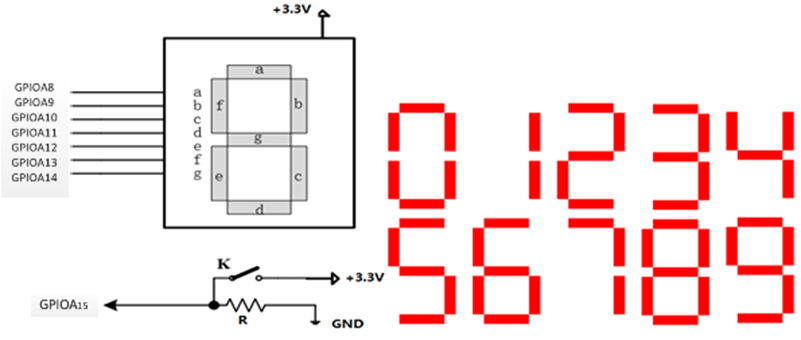

# 基于C与stm32汇编实现计算学号和并在数码管显示个位数功能

ARM Cortex-M3微处理器使用端口GPIOA控制一片七段数码管（共阳极），按键K连接GPIOA15管脚，如图所示。实现下述功能：使用查询方式查询按键状态，当按键打开时， GPIOA15管脚为“0” ，数码管显示0；当按键闭合时，GPIOA15管脚为“1”，软件触发中断IRQ0，在IRQ0处理程序中调用子程序SUMMATION实现学号各位数累加和，由数码管显示学号累加和的个位。子程序SUMMATION的入口参数为学号在存储器中存储的起始地址，通过堆栈实现入口参数的传递，SUMMATION的出口参数通过寄存器R5传递给主程序。

